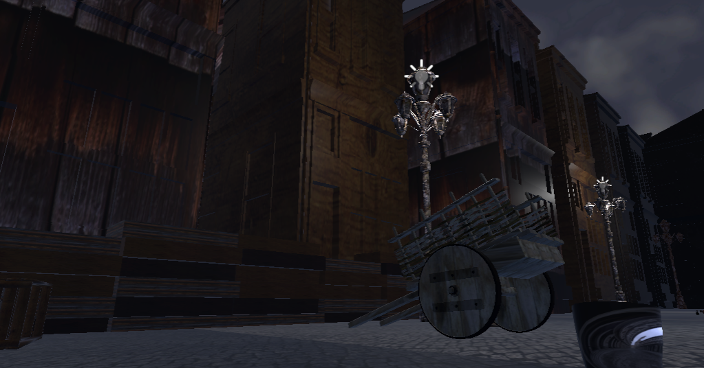
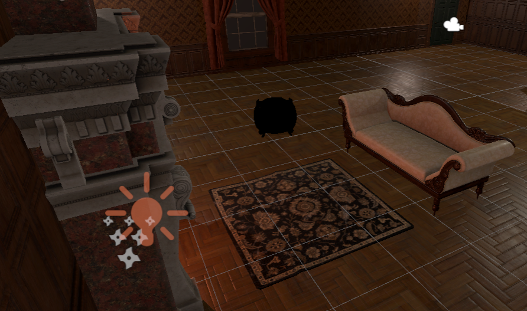
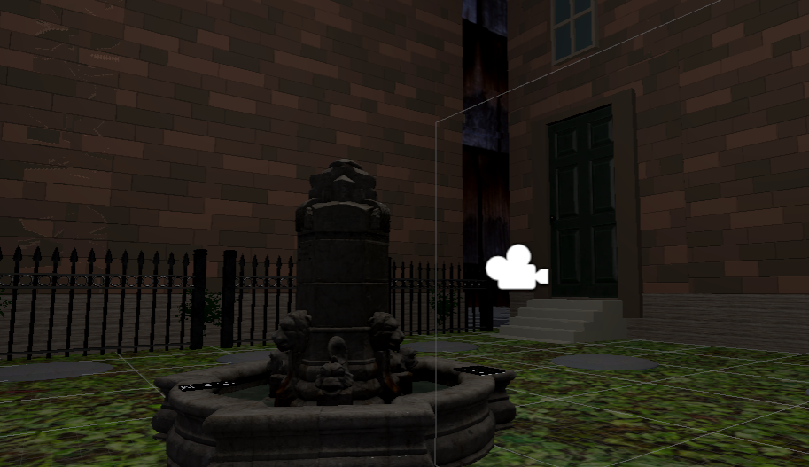
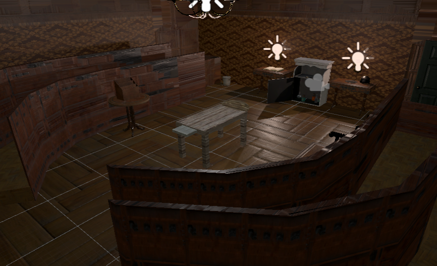
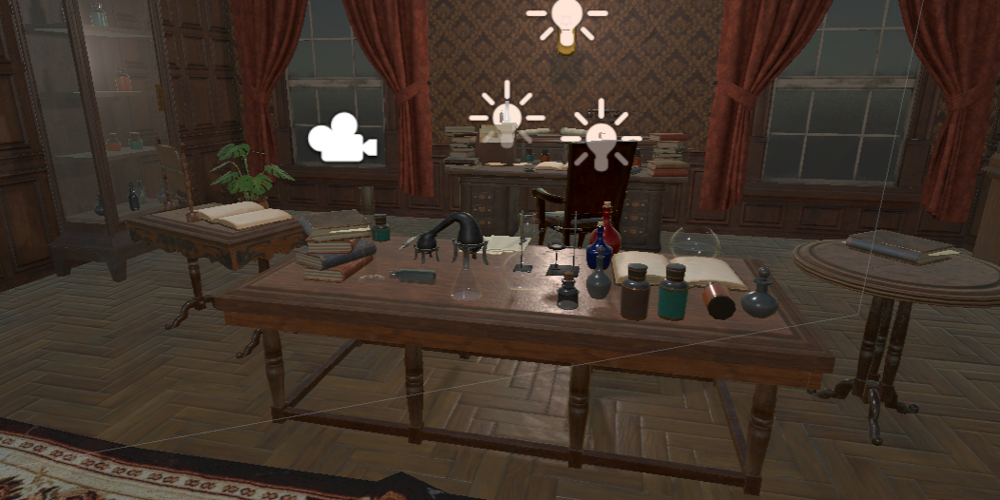

<h1 align=center>Strange Case of Dr. Jekyll & Mr. Hyde VR Experience</h1>

  

Created by Olivia Cook, Lukas Jaklitsch, Liam Kelly, Conner Pinson, and Brent Szklaruk 

## Goal

This project is meant to recreate the climax of the novella *Strange Case of Dr. Jekyll & Mr. Hyde*. The player navigates through several familiar locations from the story and collects clues pointing towards the truth behind a gruesome murder. We chose to give the player the role of an unnamed observer following in the footsteps of Dr. Jekyll's final moments.

## How we built it

This project is built on **Unity 2019.2.0f1** for the Oculus Rift/Rift S platform. You can find an executable along with the necessary accessory files on the [releases page](https://github.com/vanderbilt-virtual-reality/Jekyll-Hyde-VR/releases). We used Valve's SteamVR plugin for Unity to assist with scene transitions and ProBuilder to do custom modeling in Unity itself. We also used Blender to create custom assets. We used a number of free and premium asset packs which you can find attribution to within the [Assets folder](Assets/).

## Challenges we ran into

There were plenty. Our biggest roadblock was the git issue that caused the creation of this relaunch repo. We had issues with uploading large files that hung up the remote end. After relaunching we ran into minimal git issues with exception of the street and lab scenes which refused to upload the night before our final sprint review. An hour and a half of debugging later, we were able to fix it.

Some other issues included: getting UI text to disappear a set period of time after appearing, getting the player to transition between scenes and be in front of the logical door after transition, and ensuring all logical items were grabbable. We note that the most complete way to test software is not by the developer, but by releasing it to user. Within seconds of Dr. Molvig being in the headset, he had found collision issues and falling-through-the-floor issues. We went to work fixing all of those issues, cleaning up any areas that were supposed to be off-limits and all together beautifying the scenes.

## Things we are particularly proud of

The clue detection system is robust and aids in the freeform exploration of the experience we have created by showing the player how much more they are expected to find.

The scene transition took a long time to get right and feel natural, particularly with where you appear in the scene after transitioning.

A lot of the custom-created models deserve credit, but especially the final notes you find at the end of the experience on the desk are particularly impressive.

## What we learned

We became a lot more confident in Unity scripting and 3D modeling. Some things like the scene transition and UI control required relatively sophisticated custom C# scripts that all needed to communicate. Some items like the will, check, final notes, and the bannisters in the surgical theater were custom modeled for this environment and helped us all get used to a myriad of tools.

We also became more accustomed with collaboration tools like Trello and GitHub and utilized the Agile software development process. For some of us, it was our first time using any of these tools.

## Screenshots

The street Dr. Jekyll's house and surgical practice are located on. The player starts here.

Dr. Jekyll's house.

The courtyard between Dr. Jekyll's house and his surgical theater/laboratory.

Dr. Jekyll's surgical theater, home to his medical practice.

Dr. Jekyll's laboratory where he researches medicinal remedies and potions.

## Video Demo
[Can be found here hosted on Google Drive.](https://drive.google.com/file/d/13ZEghuptZQ9J8FwHEIyeqSs2_jSSyEIZ/view?usp=sharing) Please contact Conner if the sharing permissions are off.

### Acknowledgements

We would like to thank Dr. Bobby Bodenheimer and Dr. Ole Molvig for their help with all things Unity and game design and Dr. Jay Clayton for his insight into the source literature and scenic design.
